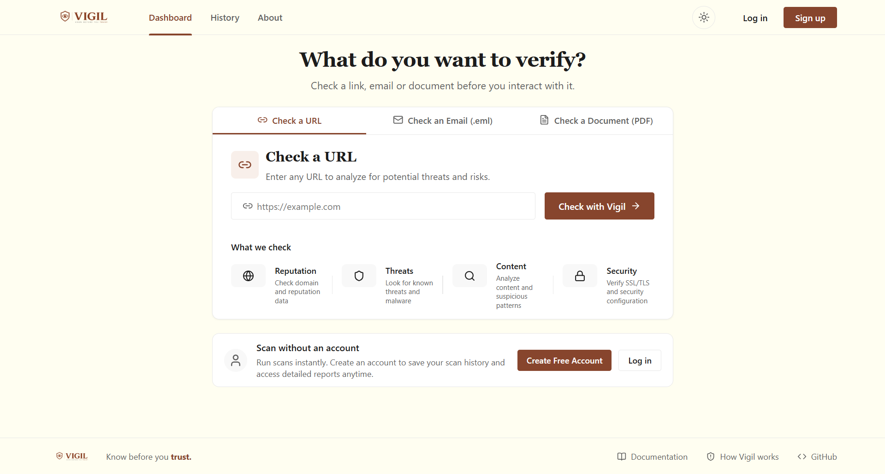
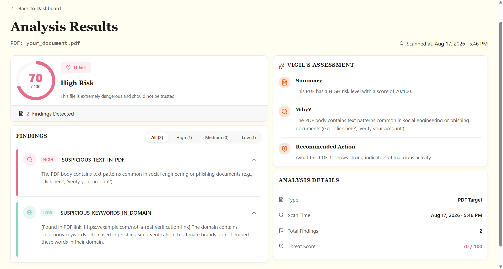

# Vigil

[](#)
[](https://opensource.org/licenses/MIT) 
[](https://vigil-gold-kappa.vercel.app)

Vigil is a real-time cybersecurity tool that flags phishing and malicious URLs instantly, using AI to explain exactly *why* a threat was detected. Designed for everyday users, security analysts, and enterprises, Vigil provides an easy-to-understand, multi-layered defense mechanism right in your browser, keeping you safe from sophisticated web-based attacks.

### 🌐 [Live Demo: vigil-gold-kappa.vercel.app](https://vigil-gold-kappa.vercel.app)

### 📸 Screenshots
**React Dashboard**

**PDF Analysis**

**Extension Analysis**

---

## ✨ Key Features

- **Real-Time URL Scanning**: Instantly analyzes any webpage you visit for hidden threats.
- **Explainable Verdicts via Gemini AI**: Translates complex security flags into plain English, so you understand the risk.
- **Threat Intelligence Enrichment**: Aggregates data from VirusTotal, URLScan.io, and RDAP to provide a comprehensive risk score.
- **Browser Extension + Dashboard**: Offers seamless on-the-fly protection (Extension) and deep-dive historical analysis (Dashboard).
- **Multi-Vector Threat Detection**: Detects malicious links, analyzes email headers, and extracts metadata from documents.

---

## 🏗️ Architecture at a Glance

Vigil utilizes a 3-tier system with a Chrome Extension for real-time interception, a React frontend for detailed analytics, and a Spring Boot backend orchestrating AI and Threat Intelligence APIs.

👉 [View the detailed Architecture Diagram in ARCHITECTURE.md](docs/architecture.md)

---

## 💻 Tech Stack

| Component | Technologies |
| :--- | :--- |
| **Frontend** | React 18, Vite, React Router, Axios, Vanilla CSS |
| **Backend** | Java 21, Spring Boot 3, Spring Security (JWT), Spring Data MongoDB |
| **Extension** | Manifest V3, Service Workers, Content Scripts, Chrome Storage API |
| **External APIs** | Gemini AI, VirusTotal (v3), urlscan.io, RDAP |
| **Database** | MongoDB Atlas / Local MongoDB |

---

## 🚀 Getting Started / Quick Start

### Prerequisites
- **Java**: JDK 21+
- **Node.js**: v18+
- **MongoDB**: Local instance or MongoDB Atlas cluster

### 1. Clone the Repository
```bash
git clone https://github.com/Divya-Jain07/Vigil.git
cd Vigil
```

### 2. Backend Setup
```bash
cd backend
# 1. Setup your environment variables (see below)
# 2. Build and run the Spring Boot application
./mvnw clean install
./mvnw spring-boot:run
```

### 3. Frontend Setup
```bash
cd frontend
# 1. Install dependencies
npm install
# 2. Run the development server
npm run dev
```

### 4. Extension Setup (Chrome)
1. Open Chrome and navigate to `chrome://extensions/`
2. Enable **Developer mode** in the top right corner.
3. Click **Load unpacked** and select the `Vigil/extension` directory.
4. Pin the extension to your toolbar!

---

## 🔐 Environment Variables

Create a `.env` file in the `backend/` root directory (refer to `.env.example` if available).

| Variable | Description | Required |
| :--- | :--- | :--- |
| `GEMINI_API_KEY` | Your Google Gemini AI API key | Yes |
| `VIRUSTOTAL_API_KEY` | Your VirusTotal API key | Yes |
| `URLSCAN_API_KEY` | Your urlscan.io API key | Yes |
| `MONGODB_URI` | MongoDB connection string (local or Atlas) | Yes |
| `JWT_SECRET` | Secret key for generating auth tokens | Yes |

---

## 📂 Folder Structure

- **`backend/`** — Spring Boot application handling API requests, AI orchestration, and database operations.
- **`frontend/`** — React application for the comprehensive analytics and historical dashboard.
- **`extension/`** — Chrome Extension source code (Manifest V3) for real-time browsing protection.
- **`docs/`** — Project documentation, architecture diagrams, and testing guides.

---

## 📚 Documentation

For deep dives into specific areas, check out our documentation:
- [API Documentation](docs/api_documentation.md)
- [System Architecture](docs/architecture.md)
- [Testing Guide](docs/testing.md)

---

## 📄 License & Credits

This project is licensed under the [MIT License](LICENSE).