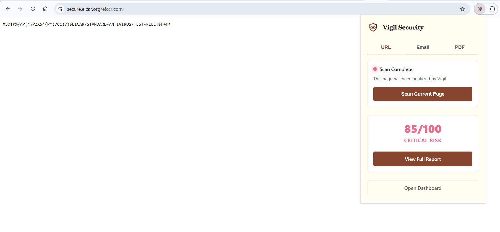

# Vigil — Real-Time Phishing & Threat Intelligence Ecosystem

> **Stay one step ahead.** Vigil is a comprehensive, multi-tiered security platform that provides real-time protection against web-based threats, phishing emails, and malicious documents by combining browser-level blocking with AI-powered threat analysis.

[](#)
[](#)
[](#)

---

## 📋 Table of Contents
- [Overview](#-overview)
- [What Makes Vigil Different](#-what-makes-vigil-different)
- [Core Features & Modules](#-core-features--modules)
- [System Architecture](#-system-architecture)
- [Tech Stack](#-tech-stack)
- [Installation & Setup](#-installation--setup)
- [Documentation & Testing](#-documentation--testing)

---

## 🌟 Overview

Vigil protects users from increasingly sophisticated cyber threats. Rather than relying on simple blocklists, Vigil employs a **dynamic scoring engine** that aggregates data from top-tier threat intelligence APIs, extracts hidden metadata from documents, and uses **Gemini AI** to explain complex technical threats in plain English. 

The platform is designed to be accessible yet powerful, offering seamless background protection via a Chrome Extension alongside a rich React Dashboard for analyzing historical scans and detailed reports.

---

## 📸 Screenshots

*(Add screenshots of your application here)*




---

## 🚀 What Makes Vigil Different

These are the engineering highlights that separate Vigil from basic URL scanners:

| Feature | Implementation |
|---|---|
| 🛡️ **Real-Time Active Blocking** | A background Chrome Extension that intercepts navigation to dangerous sites and injects a custom warning overlay directly into the DOM. |
| 🧠 **AI Threat Translation** | Technical findings (like "suspicious heuristic match" or "obfuscated javascript") are translated by Gemini AI into user-friendly explanations. |
| 📊 **Multi-Vector Scanning** | Support for parsing raw email headers/content and extracting metadata from PDF documents to catch embedded threats. |
| 📈 **Custom Risk Scoring Algorithm** | A proprietary scoring system that weighs API flags, suspicious keywords, and heuristics to assign a confidence score (0-100) and severity level (SAFE to CRITICAL). |
| 🕸️ **Cross-Platform Sync** | The Extension and Dashboard share a centralized JWT-based authentication system, keeping your scan history synced in real-time. |

---

## ✨ Core Features & Modules

### 1. Web Threat Protection
- **Automatic URL Analysis**: Scans links in real-time against VirusTotal and urlscan.io.
- **Visual Warning Overlays**: Blocks interaction with malicious pages until explicitly bypassed.
- **Safe Allowlisting**: Users can mark false positives to prevent future blocking.

### 2. Email Phishing Detection
- **Header & Body Parsing**: Analyzes raw email text for urgent/threatening language commonly used in social engineering.
- **Link Extraction**: Identifies and verifies all URLs hidden behind seemingly safe anchor text.

### 3. Document Analysis (PDF)
- **Metadata Extraction**: Flags documents with modified creation dates or missing authors.
- **Embedded Script Detection**: Identifies potentially malicious JavaScript hidden inside PDFs.

### 4. Interactive Dashboard
- **Donut Chart Visualizations**: Breaks down risk scores beautifully.
- **Scan History**: Retains a chronological record of all user scans.
- **Dark/Light Mode**: Fully responsive, CSS-variable driven theme switching.

---

## 🏗️ System Architecture

Vigil uses a 3-tier architecture to separate concerns and maximize performance:

1. **Client (Chrome Extension)**: Handles real-time DOM injection and background URL monitoring.
2. **Frontend (React/Vite)**: Serves the interactive dashboard for detailed reporting.
3. **Backend (Spring Boot)**: Acts as the intelligence hub, coordinating with external APIs (VirusTotal, urlscan, Gemini) and managing the MongoDB database.

*(For a detailed diagram, see [Architecture Documentation](docs/architecture.md))*

---

## 💻 Tech Stack

- **Frontend**: React 18, Vite, React Router, Axios, Vanilla CSS Variables.
- **Backend**: Java 21, Spring Boot 3, Spring Security (JWT), Spring Data MongoDB.
- **Extension**: Manifest V3, Service Workers, Content Scripts.
- **Database**: MongoDB Atlas.
- **External Services**: VirusTotal API (v3), urlscan.io API, Gemini API.

---

## 🛠️ Installation & Setup

### Prerequisites
- Node.js (v18+)
- Java (JDK 21+)
- Maven
- MongoDB instance

### 1. Backend Setup
```bash
cd backend
# Create your .env file with required API keys (JWT_SECRET, MONGODB_URI, GEMINI_API_KEY, etc.)
./mvnw spring-boot:run
```

### 2. Frontend Setup
```bash
cd frontend
npm install
npm run dev
```

### 3. Extension Setup
1. Open Chrome and go to `chrome://extensions/`
2. Enable **Developer mode**
3. Click **Load unpacked** and select the `Vigil/extension` directory.

---

## 📚 Documentation & Testing

Comprehensive documentation can be found in the `docs/` folder:
- [Architecture & Data Flow](docs/architecture.md)
- [API Documentation](docs/api_documentation.md)
- [Testing Guide](docs/testing.md)