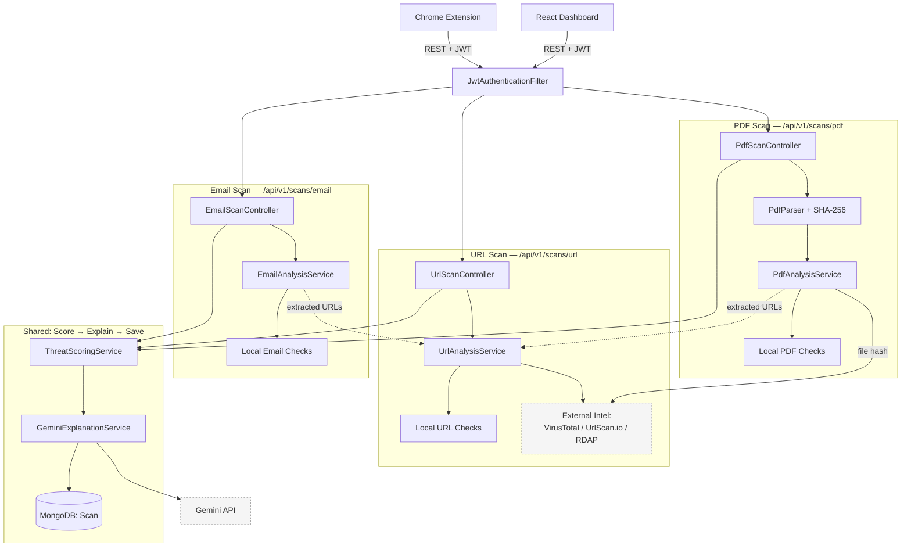
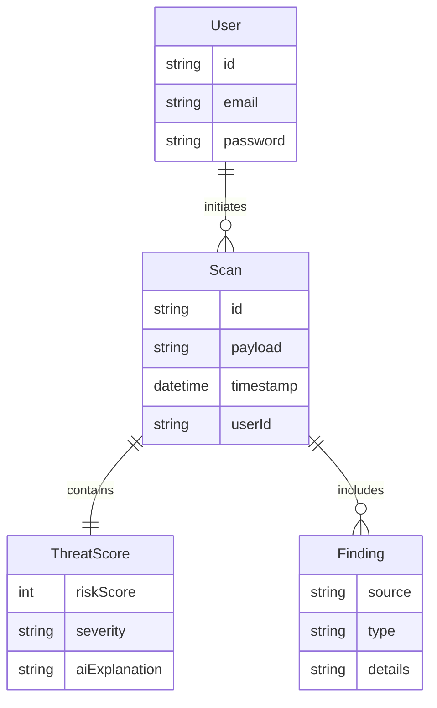

# Vigil Architecture

Vigil is a real-time cybersecurity tool that flags phishing and malicious URLs instantly, using AI to explain exactly *why* a threat was detected. Designed for everyday users, security analysts, and enterprises, it provides an easy-to-understand, multi-layered defense mechanism right in the browser to prevent sophisticated web-based attacks.

## System Diagram

## 1. Chrome Extension
**Role**: Provides real-time, on-the-fly protection and quick-access manual scanning without leaving the current webpage.
**Tech Stack**: Manifest V3, Service Workers, Content Scripts, Vanilla JS.
**Key Internal Structure**:
- `background.js`: Service worker that listens to browser navigation events, automatically triggering scans for new URLs in the background and managing extension state.
- `content.js`: Injected script responsible for rendering warning overlays directly on the DOM when a high-risk site is detected.
- `popup.html/js`: The drop-down UI for manual scans (URL, Email, PDF) and displaying high-level recent results.
**Communication**: Uses secure HTTPS REST calls to the backend, authenticated via JWT.

## 2. React Dashboard (Frontend)
**Role**: A comprehensive analytics interface where users can review detailed historical reports, manage their profile, and explore past threats in depth.
**Tech Stack**: React 18, Vite, React Router, Axios, Vanilla CSS.
**Key Internal Structure**:
- `AuthContext`: Manages JWT state and user sessions.
- `ScanResultsViewer`: Component that parses and visualizes complex scan JSON into readable Donut charts and finding rows.
- `HistoryDashboard`: Fetches and paginates past scans from the database.
**Communication**: Makes REST API requests to the backend using Axios interceptors to attach JWTs.

## 3. Spring Boot Backend
**Role**: The central coordinator that handles user requests, persists data, and orchestrates calls to various threat intelligence sources.
**Tech Stack**: Java 21, Spring Boot 3, Spring Security, Spring Data MongoDB.
**Key Internal Structure**:
- `UrlScanController` / `EmailScanController` / `PdfScanController`: The entry points (REST controllers) for frontend and extension requests.
- `AuthService`: Handles user registration, login, and JWT token issuance.
- `ScanRepository`: MongoDB interface for saving and retrieving historical scan data.
**Communication**: Exposes a RESTful API to clients and communicates with external APIs over HTTPS.

## 4. Analyzer Engine
**Role**: The core intelligence component (housed within the backend) responsible for evaluating raw threat data, calculating risk, and generating human-readable explanations.
**Tech Stack**: Java 21, Spring AI / Direct HTTP Clients, Google Guava.
**Key Internal Structure**:
- `ThreatScoringService`: Analyzes raw telemetry and calculates an aggregated risk score (0-100) and severity level (SAFE, MEDIUM, HIGH, CRITICAL).
- `GeminiExplanationService`: Submits technical findings to the Gemini LLM to generate plain-English risk summaries.
- `UrlAnalysisService`: Utilizes Google Guava's `InternetDomainName` for highly accurate extraction and analysis of top private domains (eTLD+1).
- `VirusTotalClient` / `UrlScanIoClient`: Adapters that fetch raw threat intelligence from third parties.
**Communication**: Interacts with external vendor APIs directly via HTTP/JSON.

## Data Model

- **User**: Stores authentication credentials, profile information, and preferences.
- **Scan**: The core entity representing a single analysis event. It contains the original payload (URL, Email content snippet, or PDF metadata), timestamps, and a reference to the user.
- **ThreatScore**: Embedded within a `Scan` or referenced by it. Contains the numerical risk score, severity enum, and the AI-generated explanation.
- **Finding**: Raw technical details retrieved from external APIs (e.g., specific flags from VirusTotal) attached to a `Scan`.

## Core Flows

### URL Scan Lifecycle
1. **Trigger**: Extension's `background.js` detects a tab update and sends the new URL to the backend (`/api/v1/scans/url`).
2. **Enrichment**: The backend parallelizes calls to VirusTotal and urlscan.io to gather raw threat intel.
3. **Scoring**: `ThreatScoringService` evaluates the responses and calculates a risk score.
4. **Explanation**: If threats are present, `GeminiExplanationService` translates the technical flags into a readable summary.
5. **Persistence**: The resulting `Scan` object is saved to MongoDB.
6. **Response**: The backend returns the final result to the extension.
7. **Action**: If the severity is HIGH/CRITICAL, `background.js` messages `content.js` to block the page with a warning overlay.

### Manual PDF/Email Scan Lifecycle
1. **Trigger**: User uploads a file/text via the React Dashboard or Extension popup.
2. **Extraction**: The frontend extracts relevant metadata (for PDFs) or headers/body (for Emails) and sends it to the backend.
3. **Analysis**: The Analyzer Engine processes the extracted text, scanning for malicious patterns or known bad sender domains.
4. **AI Processing**: Gemini is utilized to analyze phishing language or suspicious intent in the text.
5. **Display**: The result is saved and returned to the client, where the `ScanResultsViewer` displays the findings.

## Cross-Cutting Concerns

- **Authentication/Session**: The system uses stateless JWTs. Both the extension and dashboard authenticate against the backend `/login` endpoint. Tokens are stored securely on the client (Chrome Storage for the extension, localStorage/secure cookies for the frontend) and attached as Bearer tokens in the `Authorization` header.
- **Error Handling**: A global exception handler in Spring Boot ensures all API errors return a standardized JSON format (status, message, timestamp), which clients gracefully display to the user.
- **Scoring Logic**: Vigil's threat scoring aggregates confidence levels from multiple sources (e.g., VT flags outweigh simple heuristic flags) ensuring a balanced, deterministic risk assessment before falling back to AI intuition.

## External Dependencies

| Service | Purpose | Called By |
| --- | --- | --- |
| **Gemini AI** | Generates human-readable explanations from technical threat data. | Backend (Analyzer Engine) |
| **VirusTotal (v3)** | Provides file and URL reputation data and antivirus engine flags. | Backend (Analyzer Engine) |
| **urlscan.io** | Scans URLs in a sandbox, providing screenshots and network activity. | Backend (Analyzer Engine) |
| **RDAP** | Retrieves domain registration data to identify newly registered/suspicious domains. | Backend (Analyzer Engine) |

## Deployment Topology

- **Frontend**: Hosted on Vercel for global edge delivery.
- **Backend**: Containerized via Docker and deployed to a cloud provider, exposing the API securely over HTTPS.
- **Database**: Hosted on MongoDB Atlas, ensuring high availability and secure data storage.
- **Extension**: Published on the Chrome Web Store, auto-updating on client browsers.
