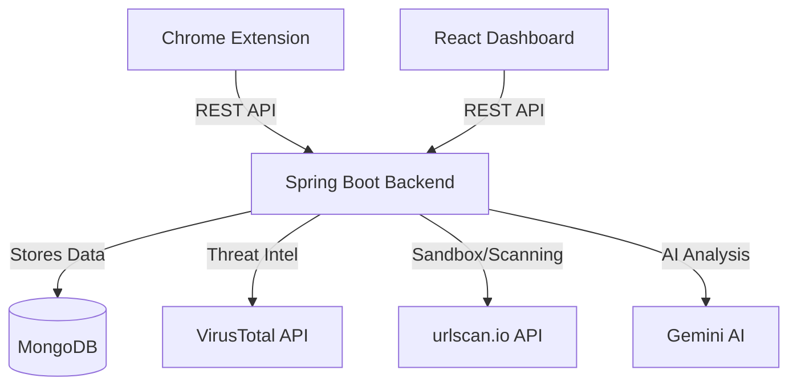

# Vigil Architecture

The Vigil ecosystem is composed of three distinct but interconnected tiers: the Client (Chrome Extension), the Frontend (React Dashboard), and the Backend (Spring Boot Service).

## System Diagram

## 1. Chrome Extension
- **Role**: Provides real-time protection and serves as a quick-access tool for manual scans.
- **Components**:
  - `background.js`: Listens to browser events (like tab updates) and automatically scans URLs in the background. It maintains state and injects warnings.
  - `content.js`: Injected into web pages to display warning overlays if the user navigates to a dangerous site.
  - `popup.html` & `popup.js`: The user interface for manual scanning (URL, Email, PDF) and viewing recent scan results.
- **Communication**: Communicates exclusively with the Spring Boot Backend via REST API, using JWT tokens for authentication.

## 2. React Dashboard (Frontend)
- **Role**: Provides a comprehensive interface for users to view detailed scan reports, manage their account, and view scan history.
- **Tech Stack**: React, Vite, React Router, Axios, standard CSS variables for theming.
- **Key Features**:
  - **Authentication**: Login and registration flows using JWT.
  - **Scan Results Viewer**: Displays complex JSON scan data in a readable, categorized format (Donut charts, finding rows, AI explanations).
  - **History**: Displays past scans pulled from the database.

## 3. Spring Boot Backend
- **Role**: The core intelligence and data processing hub. It aggregates data from various sources, scores threats, and generates AI explanations.
- **Tech Stack**: Java 21, Spring Boot 3, Spring Security (JWT), Spring Data MongoDB.
- **Core Services**:
  - `UrlScanController` / `EmailScanController` / `PdfScanController`: Expose endpoints for the extension and frontend.
  - `ThreatScoringService`: Analyzes raw data and calculates a risk score (0-100) and severity level (SAFE, MEDIUM, HIGH, CRITICAL).
  - `GeminiExplanationService`: Sends technical findings to the Gemini API to generate user-friendly explanations.
  - `VirusTotalClient` / `UrlScanIoClient`: Fetch external threat intelligence.

## Data Flow (URL Scan Example)

1. The Chrome Extension detects a new page load and sends the URL to `/api/v1/scans/url`.
2. The Backend receives the request and parallelizes calls to VirusTotal and urlscan.io.
3. The `ThreatScoringService` evaluates the responses and calculates a risk score.
4. If threats are found, the `GeminiExplanationService` translates the findings into readable text.
5. The final `ScanResult` is saved to MongoDB.
6. The Backend returns the result to the Extension.
7. If the score is high risk, the Extension's background script tells the content script to block the page with a warning overlay.
